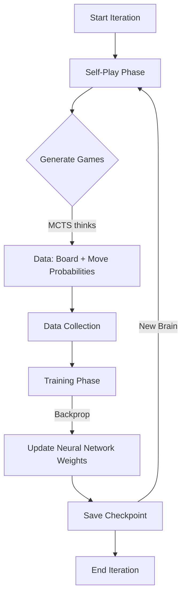

# UniversalZero Training Workflow & Data Storage

This document explains **where** your AI's experience is stored and **how** the self-learning cycle generates it.

## 1. Where can I find the "Brain"? (Storage)

The AI's "experience" consists of **neural network weights** (parameters). These are stored as binary files on your hard drive.

### Directory Structure
```
UniversalZero/
├── temp/                  <-- Breakthrough Model Storage
│   ├── best.pth.tar       <-- The CURRENT BEST brain (Use this for playing)
│   ├── checkpoint_1.pth.tar
│   ├── checkpoint_2.pth.tar
│   └── ...
├── temp_hex/              <-- Hex Model Storage
│   └── best.pth.tar
└── temp_transfer/         <-- Transplanted brains (if using transfer.py)
```

### File Format: `.pth.tar`
These are **PyTorch Checkpoint** files. They contain a dictionary with the raw numerical weights of every neuron in the network.
- **Size**: ~2-5 MB (depending on network depth).
- **Content**: `{'state_dict': { 'backbone.conv1.weight': [...], ... }}`

## 2. How is Experience Created? (The Workflow)

The training process is a continuous loop managed by `Coach` (`coach.py`).



### Step-by-Step Breakdown

1.  **Self-Play (Gathering Experience)**:
    *   The AI plays against itself (Black vs White).
    *   It uses **MCTS** (Monte Carlo Tree Search) to think ahead.
    *   **Result**: It saves thousands of positions like: *"In this board state, MCTS said moving to E4 was a good idea (60% visit count)."*

2.  **Training (Consolidating Memory)**:
    *   The system takes these thousands of "correct answers" from MCTS.
    *   It trains the **Neural Network** to predict these MCTS probabilities *without* needing to search (distilling search into intuition).
    *   It also trains the network to predict who won (Value Head).

3.  **Checkpointing (Saving Progress)**:
    *   The updated network weights are saved to `temp/best.pth.tar`.
    *   Old iterations are archived as `checkpoint_N.pth.tar`.

4.  **Iterating**:
    *   The next cycle uses the *new, smarter* network to play better games, generating even higher-quality data.
    *   This "virtuous cycle" is how AlphaZero learns from scratch!
